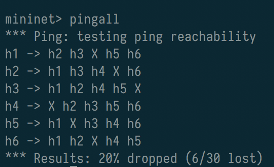

郭兴 SA17011024

# files 

- pyretic_firewall.py   the firewall application
- pyretic_switch.py     switch example code
- mn.sh                 script that starts mininet

# Firewall

a firewall app in [pyretic](https://github.com/frenetic-lang/pyretic)

- MAC learning forwarding
- firewal-policies.csv: alist of MAC pairs read as input by the firewall application.
  These pairs are the hosts can't communicate with each other.

## topology

Single

- s1 : one switch
- h1 ~ h6 : 6 hosts
- c0 : a pyretic controller

use mininet command to create this topology:

```
sudo mn --topo single,3 --mac --switch ovsk --controller remote
```

## design & implementation

1. read policies in.
2. create policy not_allowed
3. allowed = ~ not_allowed
4. allowed >> act_like_switch

Note! use `MAC('ff:ff:ff:ff:ff:ff')`. `EthAddr('f..f')` doesn't work .... emmm.


## Evaluation

1. list the firewall rules , (the given rules)

``` csv
id,mac_0,mac_1
1,00:00:00:00:00:01,00:00:00:00:00:04
2,00:00:00:00:00:02,00:00:00:00:00:05
3,00:00:00:00:00:03,00:00:00:00:00:06
```

2. record pingall screenshot ..




3. show self.policy on the screen shot after some pings

after `h1 ping h2`, `h1 ping h3`,  `self.policy` is this.  too long, so I copied it here:

```
parallel:
    if
        match:
            ('switch', 1)
            ('dstmac', 00:00:00:00:00:03)
    then
        fwd 3
    else
        parallel:
            if
                match:
                    ('switch', 1)
                    ('dstmac', 00:00:00:00:00:02)
            then
                fwd 2
            else
                parallel:
                    if
                        match:
                            ('switch', 1)
                            ('dstmac', 00:00:00:00:00:01)
                    then
                        fwd 1
                    else
                        parallel:
                            flood on:
                            -------------------------------------------------------------------------------------
                            switch  |  switch edges    |                 egress ports                           |
                            -------------------------------------------------------------------------------------
                            1       |                  |  1[2]---, 1[3]---, 1[4]---, 1[5]---, 1[6]---, 1[1]---  |
                            -------------------------------------------------------------------------------------
                            packets
                            sequential:
                                negate:
                                    match:
                                        ('switch', 1)
                                        ('srcmac', 00:00:00:00:00:01)
                                negate:
                                    match:
                                        ('switch', 1)
                                        ('srcmac', 00:00:00:00:00:02)
                                identity
                    packets
                    sequential:
                        negate:
                            match:
                                ('switch', 1)
                                ('srcmac', 00:00:00:00:00:01)
                        negate:
                            match:
                                ('switch', 1)
                                ('srcmac', 00:00:00:00:00:02)
                        identity
            packets
            sequential:
                negate:
                    match:
                        ('switch', 1)
                        ('srcmac', 00:00:00:00:00:01)
                negate:
                    match:
                        ('switch', 1)
                        ('srcmac', 00:00:00:00:00:02)
                identity
    packets
    sequential:
        negate:
            match:
                ('switch', 1)
                ('srcmac', 00:00:00:00:00:01)
        negate:
            match:
                ('switch', 1)
                ('srcmac', 00:00:00:00:00:02)
        identity
```

 explain the policy


```
    if
        match:
            ('switch', 1)
            ('dstmac', 00:00:00:00:00:03)
    then
        fwd 3
```

if dstmac=03, fwd 3, 

else if dstmac=02, fwd 2

else if dstmac=01, fwd 1

these are learning from ARP.

otherwise, flood.


